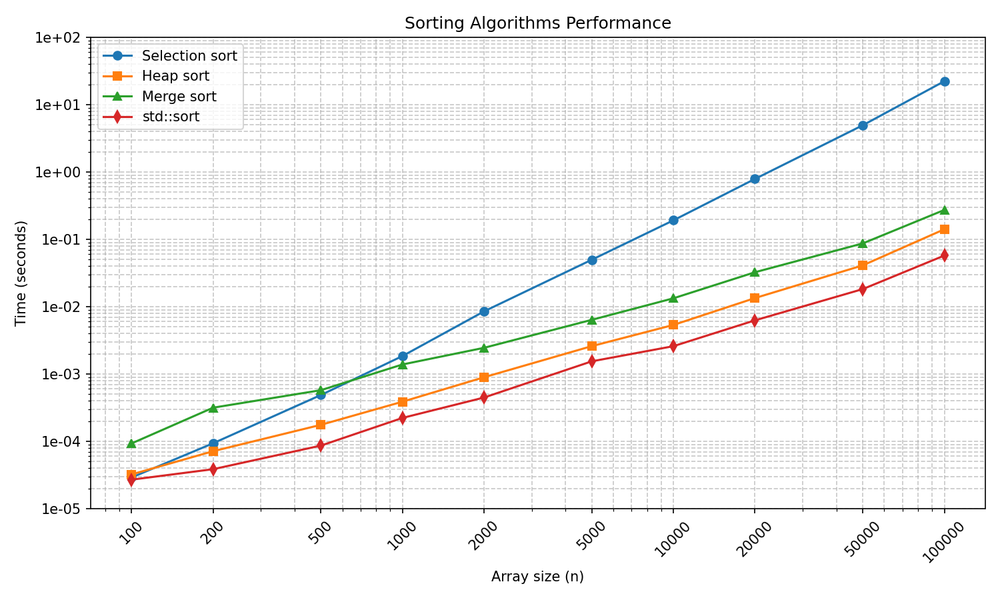

# Лабораторная работа №1: Тестирование и сравнение алгоритмов сортировки для записей об абитуриентах (вариант 16)

## Документация Doxygen

## Исходный код
[GitHub](https://github.com/mlianskaya/programming_techniques.git)  

## Графики

## Описание
В работе реализованы алгоритмы сортировки: выбором, пирамидальная, слиянием и `std::sort`.  
Объект сортировки – структура «Абитуриент» (ФИО, факультет, специальность, сумма баллов).  
Сравнение выполняется по сумме баллов (по убыванию), затем по ФИО, факультету и специальности.  
Проведены замеры времени для массивов от 100 до 100 000 элементов. График результатов приведен в отчёте.
